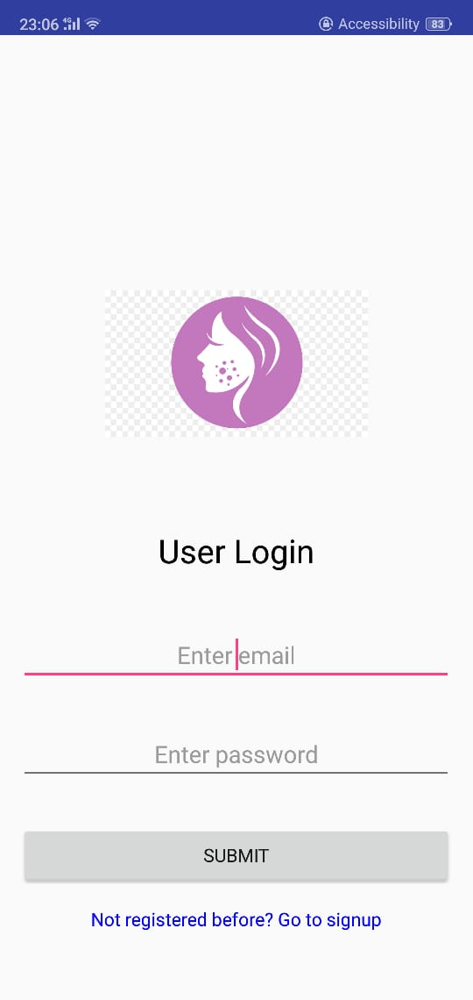

# Skin_Care_App
* Unskript2k19 Winning Solution!!
* An android app that classifies among 8 different skin cancers + normal skin based on images of the affected part

#### -- Project Status: Active

## Introduction
The purpose of the project is to give the user a probabilistic prediction on the skin disease he/she might have based on the images of the affected part of the skin that the user clicks or uploads from gallery. We have used a MobileNet as the model and trained it on a combination of HAM10000, images sourced from google & manually collected images. Apart from the 10013 images in the HAM10000, we collected around 6000 additional images from the other two strategies.

### Technologies
* Python
* Keras Library
* TensorFlow
* Jupyter notebook
* FireBase
* Java
* Android Studio
* TFLite

## App Login Page

## Contact
* Feel free to contact me on nikhil.css97@gmail.com with any questions or if you are interested in contributing!
